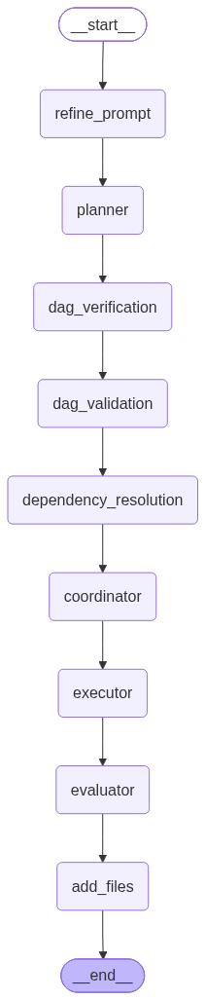

# Multi-Agent Code Generation Pipeline

Turn a single natural-language request into a parallel-executed, contract-verified codebase.

This project decomposes a software request into a dependency graph of small, single-file
implementation tasks, has independent LLM agents implement each task **in parallel**, and
uses an explicit, machine-checked **dependency contract** to keep those parallel outputs
interoperable — instead of hoping a large context window keeps everything consistent.

Built on [LangGraph](https://github.com/langchain-ai/langgraph), with structural correctness
(cycle detection, shared-file-write ordering, topological levels) enforced by Pydantic
validators and plain Python — not by prompting the model to "please be consistent."

---

## Architecture

The pipeline is a single linear LangGraph `StateGraph`. Phases 2, 4, and 6 fan out into one
LLM call per task and fan back in.

<!-- Drop the exported LangGraph diagram here, e.g. via
     app.get_graph().draw_mermaid_png("docs/graph.png") -->


## Why this exists

Handing one LLM an entire project and a huge context window doesn't scale, and handing
independent LLMs isolated tasks with no shared source of truth produces code that doesn't
integrate. This pipeline splits the difference:

- **Decomposition is separated from implementation.** A task DAG is planned, verified, and
  validated *before* any code is written.
- **Every cross-task interface is written down once, formally, before implementation
  starts.** Names, signatures, import paths, and schemas are fixed by a coordinator agent
  into a single canonical contract. Executors have zero freedom to rename or reshape
  anything the contract defines — their only creative latitude is business logic.
- **Structural correctness is computed, not requested.** Cycle detection, topological
  parallelism levels, and shared-output-file write/append ordering are implemented as
  Pydantic model validators and plain functions (`schemas.py`, `dag_utils.py`), so an
  invalid DAG or a racing file write fails validation immediately rather than surfacing as
  a runtime bug three phases later.
- **Every task produces exactly one file.** This is enforced at the schema level
  (`OutputFile.path` must be a file, not a directory) and is the unit the entire pipeline
  reasons about — one task, one deliverable, one executor.

## Pipeline phases

| # | Node | Agent role | Fan-out | Output |
|---|------|-----------|---------|--------|
| 0 | `refine_prompt` | Planning Context Generator — turns a raw request into a structured spec (requirements, constraints, assumptions, success criteria) | no | Markdown spec |
| 1 | `planner` | Planner Agent — decomposes the spec into a task DAG; proposes one output file per task | no | `PlannerOutput` (DAG) |
| 2 | `dag_verification` | DAG Verification Agent — one instance per task, reviews the DAG from that task's own perspective (missing/unnecessary dependencies, scope drift, output-file collisions) | **parallel, 1/task** | `VerificationOutput[]` |
| 3 | `dag_validation` | Validation Agent — reconciles all verification reports into the canonical DAG. Skipped (pass-through) if no task reported an issue | no | `ValidationOutput` (final DAG) |
| 4 | `dependency_resolution` | Dependency Specification Agent — one instance per task, defines exact signatures/imports/schemas for everything that task consumes and produces | **parallel, 1/task** | `DependencySpecOutput[]` |
| 5 | `coordinator` | Dependency Coordinator — merges all per-task specs into one conflict-free, canonical contract; finalizes every output file path | no | `CoordinatorOutput` (contracts + final DAG) |
| 6 | `executor` | Executor Agent — one instance per task, implements the task using only the coordinator's contract as ground truth for names and paths | **parallel, 1/task** | `ExecutorOutput[]` |
| 7 | `evaluator` | Evaluator Agent — verifies each implementation against its contract and checks integration boundaries against peer implementations | **parallel, 1/task** | `EvaluatorOutput[]` |
| — | `add_files` | Writes every executor's implementation to disk at its finalized path | — | `executor_output/` |

## Project layout

```text
configs/
  llm_config.yaml         # Provider pool: models, keys, rate limits
prompts/
  v1/                      # Original prompt set (0–7, one file per phase)
  v2/                      # Current prompt set — stricter field rules,
                            # explicit failure conditions, closed enums
src/
  run.py                   # CLI entry point
  graph.py                 # Builds and wires the LangGraph StateGraph
  state.py                 # Pipeline State TypedDict + default_state()
  schemas.py                # Pydantic models for every phase's output,
                            # plus the DAG-level validators (cycles,
                            # shared-path ordering, dependency existence)
  eval_schemas.py           # Test-case / verdict models for the Evaluator
  dag_utils.py              # Topological sort, DAG → Markdown rendering
  fanout.py                  # Batched fan-out with per-task retry
  io_utils.py                # Async file I/O, error logging
  prompts.py                  # Loads prompts/v{N}/*.md by phase name
  llm_registry.py              # Maps each phase to an LLM client
  nodes/                        # One module per graph node
  pool_manager/
    llm.py                      # MultiProviderChatLLM (async-only)
    scheduler.py                 # Picks a healthy endpoint per call
    endpoint_state.py             # Per-(provider, model, key) rate limits
outputs/                    # Human-readable Markdown log, one per phase
snapshots/                  # JSON state snapshots after each phase
executor_output/            # The actual generated project files
checkpoints.db              # SQLite checkpoint store (resumable runs)
error.log                   # Exceptions captured during any phase
```

## Getting started

### Requirements

- Python 3.11+
- A Google Gemini API key (the shipped config uses Gemini; see [Providers](#providers) to add others)

### Install

```bash
pip install -r requirements.txt
```

### Configure

Set the API key(s) referenced in `configs/llm_config.yaml`:

```bash
export GEMINI_API_KEY="..."
export GEMINI_API_KEY2="..."   # optional second key, pools with the first
```

### Run

```bash
python src/run.py "Build a REST API for a URL shortener with Postgres and rate limiting"
```

Or omit the argument and you'll be prompted interactively. Useful flags:

```bash
python src/run.py "..." \
  --config  configs/llm_config.yaml \
  --prompts prompts \
  --db      checkpoints.db \
  --thread  my-run-id \
  --pool    8
```

Generated files land in `executor_output/`, mirroring the paths the coordinator finalized
in Phase 5.

### Resuming

Every phase checkpoints to `checkpoints.db` (via `AsyncSqliteSaver`) under the given
`--thread`. Re-running `run.py` with the same `--thread` and no question resumes an
interrupted run from wherever it left off, instead of starting over.

## Configuration reference

`configs/llm_config.yaml` defines a pool of LLM endpoints per provider:

```yaml
google:
  models:
    - gemini-3.1-flash-lite
  keys:
    - GEMINI_API_KEY
    - GEMINI_API_KEY2
  rpm_limit: 4       # per (model, key) pair
  rpd_limit: 20      # per (model, key) pair
```

Every `(provider, model, key)` triple becomes one independent `EndpointState` with its own
rolling per-minute and per-day request counters. The scheduler (`pool_manager/scheduler.py`)
picks the least-busy available endpoint for each call, respects a 60-second cooldown after
any 429, and raises `AllEndpointsExhausted` if nothing frees up within `max_wait_seconds`
(default 120s) — so a two-key Gemini pool like the example above effectively behaves as
8 rpm / 40 rpd. Additional providers (Groq, Hugging Face, OpenRouter) are stubbed out in
the same config file and can be re-enabled by uncommenting them; anything OpenAI-compatible
works via `ChatOpenAI` with a custom `base_url`.

### Fan-out and retries

Phases 2, 4, and 6 dispatch one LLM call per task through `run_fanout()`
(`src/fanout.py`), which batches all tasks via `chain.abatch()`, isolates per-task
failures, and retries only the failed subset (2 attempts total) before returning
`(successes, remaining_failures)`.

## Prompt versions

Two full prompt sets live under `prompts/`. `v2` (the current default) tightens `v1`
considerably:

- DAG Verification (`2.`) replaces free-form review guidance with nine numbered, mechanical
  checks — including a formal rule for when a shared `output_file.path` is a valid
  write-then-append chain versus a real collision.
- Dependency Specification (`4.`) requires exactly one `DependencySpec` per named artifact
  (not per producer task) and lists explicit machine-checkable failure conditions.
- The Coordinator (`5.`) prompt adds an explicit conflict-resolution priority order and
  worked examples, including how to handle an "orphaned expectation" — a consumer that
  depends on an artifact its named producer never actually defined.
- Task categories are a closed, shared enum (`backend`, `frontend`, `database`, `api`,
  `security`, `testing`, `infrastructure`, `documentation`, `configuration`, `monitoring`,
  `ml`, `integration`) reused verbatim across planning, validation, and dependency
  resolution so categorization can't silently drift between phases.

Switch versions by editing `prompts.version` in `configs/prompts_config.yaml`.

## Outputs & artifacts

| Path | Contents |
|---|---|
| `outputs/*.md` | Human-readable log per phase (DAG, decomposition rationale, per-task verification/execution summaries) |
| `snapshots/*.json` | Full pipeline `State` after each phase — the same data the checkpointer persists, in inspectable form |
| `executor_output/` | The generated project itself, one file per task at its coordinator-finalized path |
| `checkpoints.db` | SQLite-backed LangGraph checkpoints, keyed by `--thread` |
| `error.log` | Traceback + phase name for any exception raised while writing a phase's output |

## Design notes

- **State is a single `TypedDict`** (`src/state.py`) threaded through every node; each node
  returns only the keys it updates, and LangGraph merges them in.
- **Parallelism analysis is computed in code**, not requested from a model:
  `compute_parallelism_analysis()` in `schemas.py` runs a longest-path leveling pass over
  the DAG and is fed back into the Verification and Validation prompts as read-only context,
  so the model reasons about parallelism it can trust rather than parallelism it guessed.
- **Validation is layered.** The Planner, Validation, and Coordinator outputs all share the
  same Pydantic-level guarantees (`PlannerOutput`, `ValidationOutput`, `CoordinatorOutput`):
  no cycles, every dependency reference resolves to a real task, and every shared output
  path forms a legal write/append chain. A structurally invalid DAG never reaches Phase 4.
- **Executors have exactly one degree of freedom**: business logic inside the names,
  signatures, and file locations the contract already fixed. This is what makes fully
  parallel, independent implementation viable without a final "make it all fit together"
  pass — though see [Status](#status) below.

## Status

- Phases 0–6 are fully wired and produce validated, contract-compliant implementations.
- Phase 7 (`evaluator`) has a complete schema (`eval_schemas.py`: test cases, coverage
  gaps, fault attribution, verdicts) designed for LLM-judged and sandbox-executed
  contract/integration checks, but the corresponding graph node
  (`src/nodes/evaluator.py`) is currently a pass-through stub — it does not yet invoke the
  chain or aggregate results into the `State`'s scoring fields. Wiring the evaluator node
  up to `eval_schemas.py` is the main open piece of work.

## Extending

- **Add a provider**: uncomment or add a block in `configs/llm_config.yaml` with
  `models`, `keys`, `rpm_limit`, `rpd_limit`, and (for non-Google providers) `base_url`.
  `pool_manager/llm.py` routes Google model names to `ChatGoogleGenerativeAI` and
  everything else to `ChatOpenAI`.
- **Add a phase**: register a `(build_chain, node_fn)` pair in `src/nodes/__init__.py`'s
  `REGISTRY`, add the node and edge in `graph.py`, and add a prompt file + entry in
  `NODE_FILENAMES` (`src/prompts.py`).
- **Change task categories**: edit the shared `TaskCategory` literal in `schemas.py` — it's
  the single source of truth referenced by the Planner and Validation prompts.